# Hi there 👋

## 📽️ framework demos
*See what others have built*

<a href="https://github.com/waiyan1612/data-quality-demos"></a>
<a href="https://github.com/waiyan1612/data-lineage-demos"></a>
 

<a href="https://github.com/waiyan1612/data-pipeline-demos"></a>
<a href="https://github.com/waiyan1612/postgres-kafka-iceberg-pipeline"></a>
 

## 🛝 playgrounds
*Get to work*

<a href="https://github.com/waiyan1612/playground-kafka"></a>
<a href="https://github.com/waiyan1612/playground-java"></a>
 

<a href="https://github.com/waiyan1612/playground-python"></a>
<a href="https://github.com/waiyan1612/ume"></a>
 

## 🍲 cooked
*Sometimes, with vibes*

<a href="https://github.com/waiyan1612/WillowTeX"></a>
<a href="https://github.com/waiyan1612/rtpa"></a>
 

<a href="https://github.com/waiyan1612/screen-grabber"></a>
 

